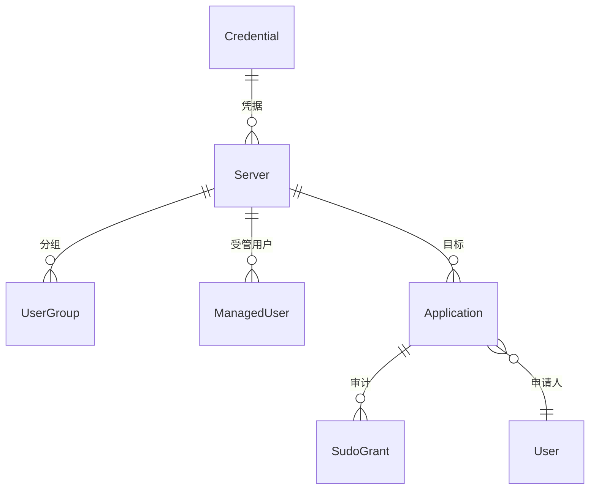

# 架构设计

## 应用结构

| 应用 | 职责 |
|------|------|
| `accounts` | 用户注册/登录（用户与管理员地位平等）、用户名建议接口（pypinyin 复姓/多音字生成） |
| `applications` | 申请单模型、登录申请、审批、开通联动、sudo 审计（SudoGrant） |
| `servers` | 服务器/用户分组/受管用户模型、SSH 执行与接管/开通/迁移服务 |
| `credentials` | 目标机器登录凭据（敏感字段加密存储） |
| `notifications` | 邮件（SMTP 配置模型 + 发送服务）与 Webhook（配置模型 + 推送服务） |
| `config` | Django 项目配置 |

## 关键模型



### 申请生命周期

```
登录提交(pending) → 审批通过(approved) → 机器开通(provisioned_at) → 到期(valid_until / sudo当日失效)
```

## SSH 执行层（servers/ssh.py + management.py）

- `exec_command`：paramiko 执行命令，**校验退出码**（非零视为失败）
- `_sudo_wrap`：SSH 用户非 root 时，为特权命令自动加 `sudo -n`（按管道分段，不误拆 `||`）
- `provision_user`：建用户 → 设密码 → `chage -d 0` 强制改密
- `migrate_home_dir`：迁移目录（空目标先移除、`mv -T` 防嵌套、chown 失败回滚）
- `grant_sudo` / `revoke_sudo`：sudo/wheel 组授予与撤销（自动探测组名）

## 安全设计

| 关注点 | 措施 |
|--------|------|
| 凭据落库 | Fernet 加密（密钥由 `SECRET_KEY` 派生），页面不展示明文 |
| 机器权限 | 所有受管用户为普通用户，统一加入 `nrm_managed` 组 |
| sudo 审计 | SudoGrant 记录授予人/时间，当日 23:59:59 失效，`expire_sudo` 命令撤销 |
| 命令注入 | 目录迁移校验绝对路径与非法字符；用户名/路径不拼接未校验输入 |
| 密码安全 | 16 位随机密码、强制首次登录修改、不落库 |

## 通知链路

```
申请提交 ──┬──> EmailConfig(SMTP) ──> 管理员
           └──> WebhookConfig ──> POST JSON
审批完成 ──┬──> EmailConfig ──> 申请者
           └──> WebhookConfig ──> POST JSON
开通成功 ──> EmailConfig ──> 申请者（用户名+随机密码）
```
