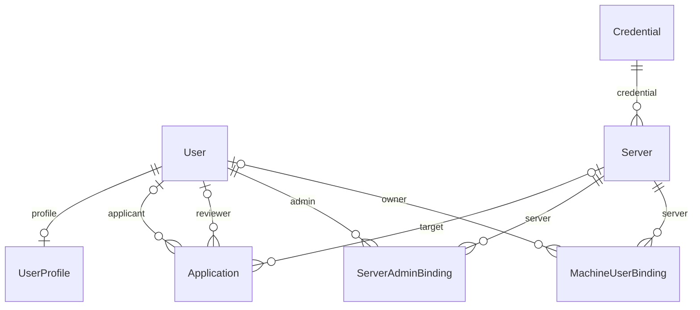

# 架构设计

## 设计取舍

NRM 采用 Django 单体、SQLite 和单进程部署，优先保证小团队可维护性。通用账号、权限、表单、后台管理、登录限流和 OAuth 分别复用 Django、django-axes 与 django-allauth；项目代码只保留服务器申请和 SSH 操作领域逻辑。

## 应用职责

| 应用 | 职责 |
|------|------|
| `accounts` | 注册、个人资料、密码找回、GitCode 绑定、系统设置、公告、邮箱验证码 |
| `applications` | 工单权限范围、申请/审批状态、开通编排、失败重试 |
| `servers` | 服务器、管理员绑定、机器用户归属、SSH 与目标机脚本、设备概览 |
| `credentials` | 加密保存目标机管理凭据；管理界面复用 Django Admin |
| `notifications` | SMTP、邮件 Webhook、事件 Webhook 与出站地址安全校验 |
| `config` | 运行模式、安全设置、根路由和角色装饰器 |

## 数据关系



工单保存申请时的姓名、工号、邮箱和机器用户名快照。删除平台用户只会把 `applicant` 置空，不会删除历史工单。

## 工单状态与机器结果

```text
pending ──通过──> approved ──SSH 成功──> provisioned_at 已记录
   │                   └────SSH 失败──> provision_note 记录原因，可重试
   ├──驳回──> rejected
   └──撤回──> withdrawn
```

状态“已通过”和“机器操作已完成”是两个事实，分别由 `status` 与 `provisioned_at` 表示。审批更新通过条件更新避免重复审批；数据库唯一约束阻止同一服务器、同一用户名出现多个进行中工单。

## SSH 边界

- 连接必须使用管理员经可信渠道确认的 OpenSSH `SHA256:` 主机指纹。
- 禁止自动信任未知主机、SSH agent 和本机默认私钥。
- 特权脚本经 SFTP 上传到随机 0700 临时目录，执行后清理。
- 用户名和用户组在进入脚本前做白名单校验；密码通过标准输入传递，不进入命令行。
- 审批时同步执行关键 SSH 操作。项目没有持久任务队列，不能把开通交给 daemon 线程。

## 通知边界

通知是非关键副作用：提交和审批完成后可在进程内后台发送，失败写日志但不回滚工单或机器操作。Webhook 仅允许公网 HTTPS，并在发送时重新解析、校验并固定目标 IP，防止 SSRF 与 DNS 重绑定。

## 部署边界

LocMem 缓存用于 select2 状态和短期 SSH 查询缓存，因此推荐单 Gunicorn worker、多线程运行。多实例部署需要共享缓存、外部数据库和持久任务队列，不属于当前产品范围。
